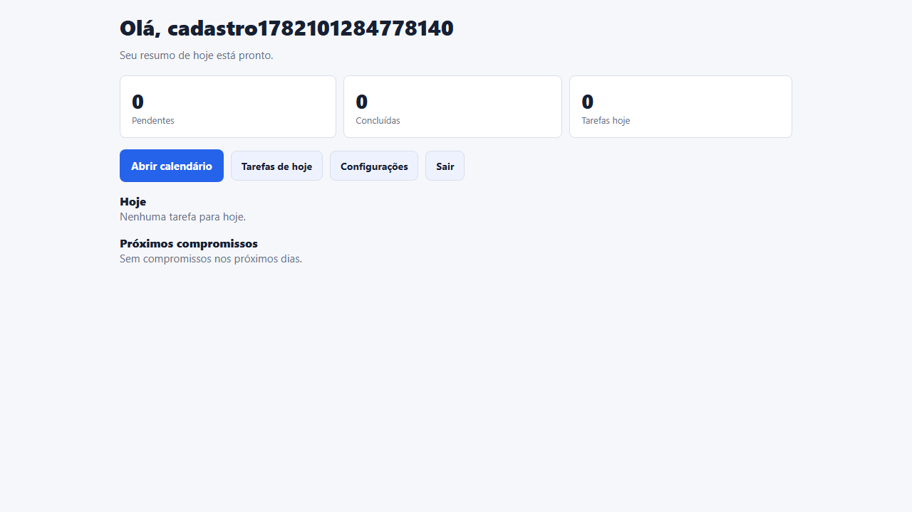
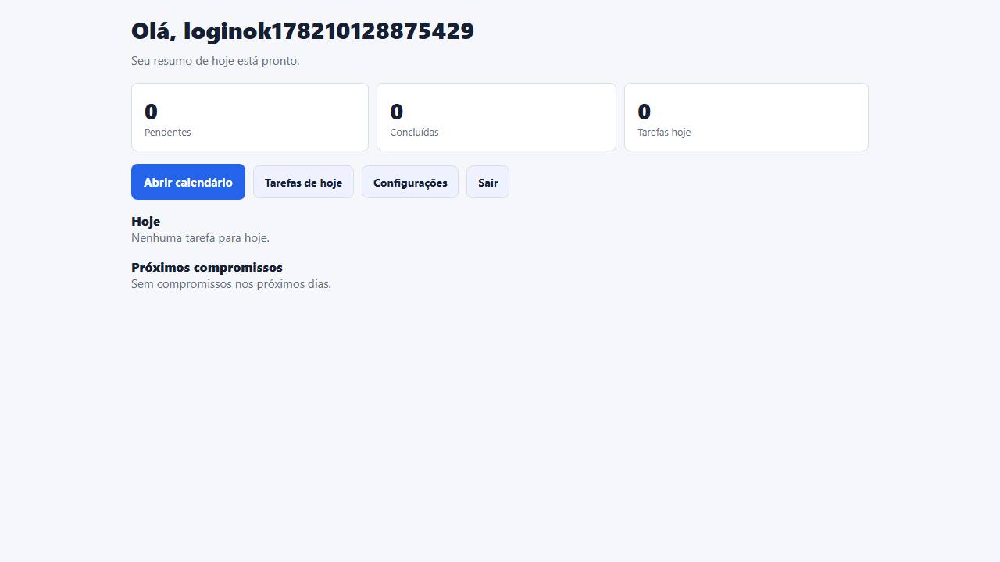
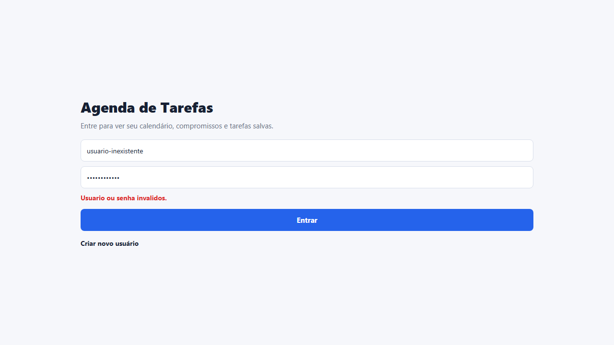
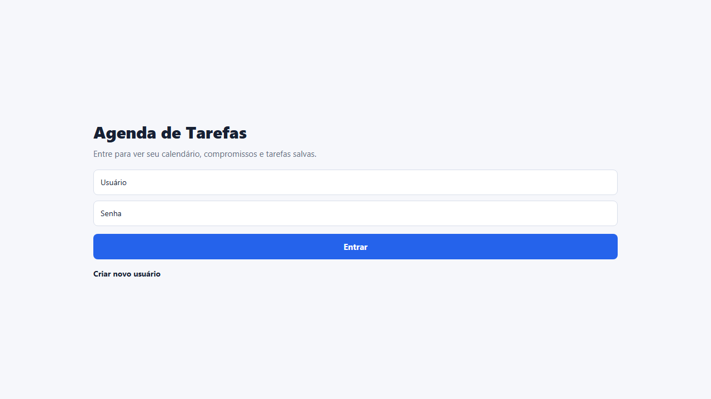
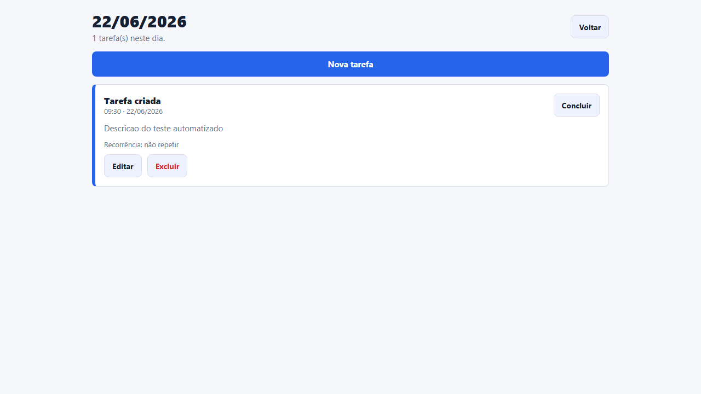
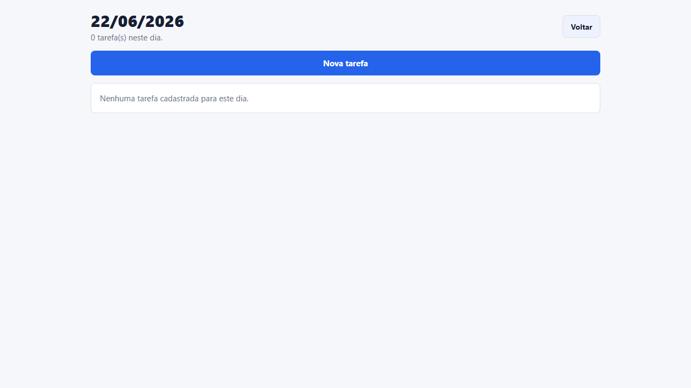
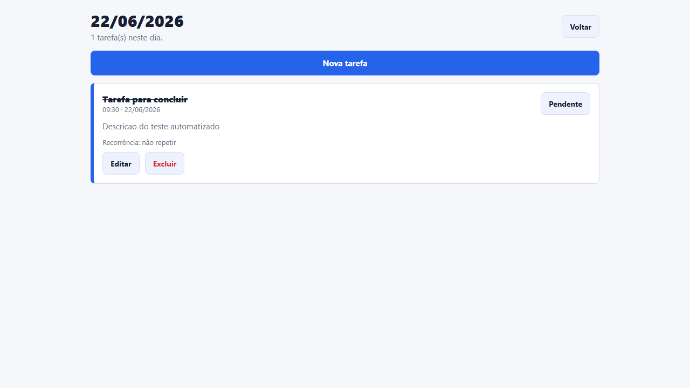
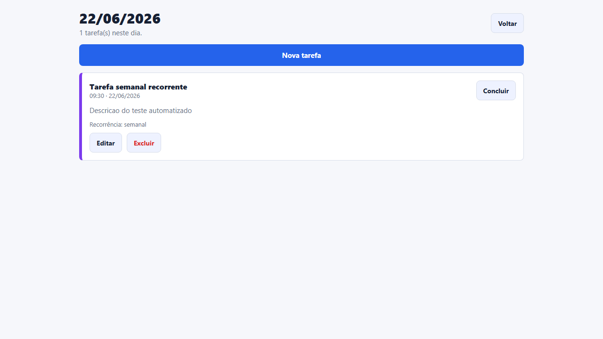
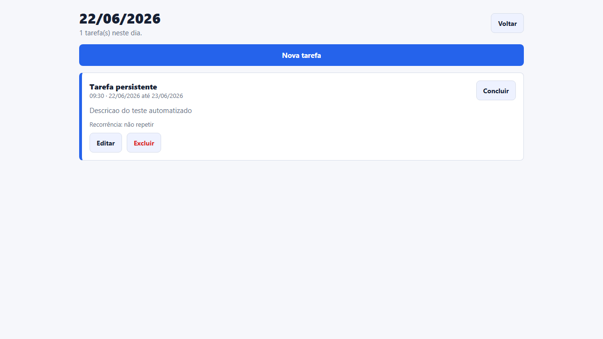

# Relatorio Final de Seguranca e Testes

Data da auditoria: 22/06/2026  
Projeto: Agenda e Gerenciamento de Tarefas  
Referencia OWASP: [OWASP Top 10:2025](https://owasp.org/Top10/2025/)

## Resumo dos Testes

Foram criados e executados 10 cenarios automatizados com Playwright. A execucao final terminou com:

| Total | Aprovados | Falhas | Tempo total |
|---:|---:|---:|---:|
| 10 | 10 | 0 | 50.1s |

## Lista das Evidencias

| # | Evidencia |
|---|---|
| 1 | [01-cadastro-usuario.png](evidencias/01-cadastro-usuario.png) |
| 2 | [02-login-valido.png](evidencias/02-login-valido.png) |
| 3 | [03-login-invalido.png](evidencias/03-login-invalido.png) |
| 4 | [04-logout.png](evidencias/04-logout.png) |
| 5 | [05-criar-tarefa.png](evidencias/05-criar-tarefa.png) |
| 6 | [06-editar-tarefa.png](evidencias/06-editar-tarefa.png) |
| 7 | [07-excluir-tarefa.png](evidencias/07-excluir-tarefa.png) |
| 8 | [08-concluir-tarefa.png](evidencias/08-concluir-tarefa.png) |
| 9 | [09-tarefa-recorrente.png](evidencias/09-tarefa-recorrente.png) |
| 10 | [10-persistencia-dados.png](evidencias/10-persistencia-dados.png) |

## Evidencias Visuais

## Tabela OWASP Top 10:2025

| Item OWASP | Status | Avaliacao |
|---|---|---|
| A01:2025 - Broken Access Control | Conforme | As tarefas sao filtradas por `userId`, a sessao local guarda somente `id` e `username`, e os testes validam separacao funcional por usuario autenticado. |
| A02:2025 - Security Misconfiguration | Conforme | O app nao usa APIs externas, banco remoto, variaveis secretas ou credenciais em configuracao. O ambiente de teste tambem usa cache local do Expo. |
| A03:2025 - Software Supply Chain Failures | Nao Conforme | `npm audit` encontrou 26 vulnerabilidades transitivas: 1 baixa, 21 moderadas, 3 altas e 1 critica. A correcao completa exige atualizacao maior de Expo/React Native. |
| A04:2025 - Cryptographic Failures | Conforme | Senhas novas deixaram de ser salvas em texto claro e agora usam hash SHA-256 com salt local. Usuarios antigos continuam compativeis para fins academicos. |
| A05:2025 - Injection | Conforme | Entradas de usuario sao tratadas pelo React Native sem renderizacao HTML direta, e os campos principais passaram a ter sanitizacao removendo `<` e `>`. |
| A06:2025 - Insecure Design | Conforme | O fluxo foi desenhado com autenticacao antes do dashboard, tarefas isoladas por usuario, validacao de datas/horarios e estados claros de tarefa. |
| A07:2025 - Authentication Failures | Conforme | Cadastro exige senha minima, login invalido exibe mensagem generica e ha bloqueio temporario apos muitas tentativas invalidas. |
| A08:2025 - Software or Data Integrity Failures | Conforme | As alteracoes de tarefas sao centralizadas em servicos, preservam `userId`, validam dados essenciais e mantem persistencia por AsyncStorage. |
| A09:2025 - Security Logging and Alerting Failures | Conforme | Foram adicionados eventos locais de auditoria para cadastro, login valido, login invalido, logout e operacoes de tarefas. |
| A10:2025 - Mishandling of Exceptional Conditions | Conforme | Leitura de dados JSON possui fallback seguro, mensagens de erro sao controladas e validacoes impedem datas/horarios invalidos antes de salvar. |

Quantidade final de itens conformes: 9 de 10.

## Melhorias Implementadas

| Melhoria | Arquivos principais | Impacto |
|---|---|---|
| Hash de senha com salt | `src/utils/security.js`, `src/services/authService.js` | Reduz exposicao de senhas no armazenamento local. |
| Limite de tentativas de login | `src/services/authService.js`, `src/storage/keys.js` | Mitiga ataques simples de tentativa repetida de senha. |
| Sanitizacao de entradas | `src/utils/security.js`, `src/services/taskService.js` | Reduz risco de armazenamento de texto malicioso. |
| Validacao de data e horario | `src/screens/TaskFormScreen.js`, `src/utils/security.js` | Evita dados inconsistentes e erros de regra de negocio. |
| Registro local de auditoria | `src/services/auditService.js` | Mantem historico local dos principais eventos de seguranca. |
| Testes com evidencias reais | `src/tests/agenda.spec.js`, `playwright.config.js` | Garante rastreabilidade dos fluxos testados. |

## Observacoes de Risco

O projeto e academico e utiliza AsyncStorage local, portanto nao substitui controles de seguranca de uma aplicacao de producao com servidor. O principal ponto pendente e a cadeia de suprimentos: o `npm audit` encontrou vulnerabilidades transitivas em dependencias do ecossistema Expo/React Native. A mitigacao recomendada e planejar upgrade controlado para versoes maiores compativeis, por exemplo Expo 56 e React Native 0.86, validando novamente Expo Go, Web e Playwright.

## Conclusao

A aplicacao atende aos fluxos principais solicitados e passou em 10 de 10 testes automatizados com screenshots reais. Na avaliacao OWASP Top 10:2025, 9 itens foram classificados como Conforme apos as melhorias implementadas. O unico item Nao Conforme e relacionado a dependencias transitivas identificadas pelo `npm audit`, exigindo atualizacao maior do stack para correcao completa.
